### 安装docker

```
yum -y install docker
```

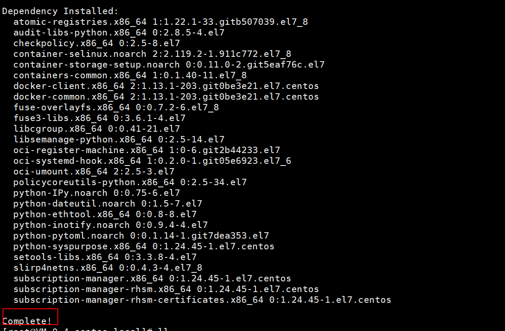

### 启动docker

```
start docker
```

拉取mysql镜像并指定版本号

```
docker pull mysql:8.0.18
```

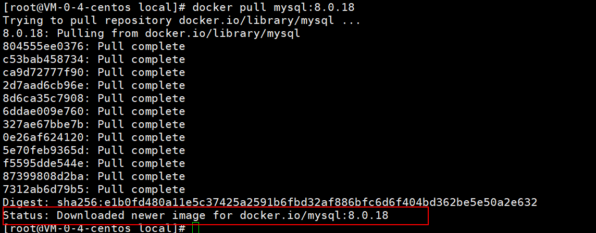

说明拉取成功

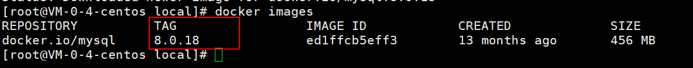

### 查看本地mysql镜像是否下载成功

```
docker images mysql:8.0.18
```

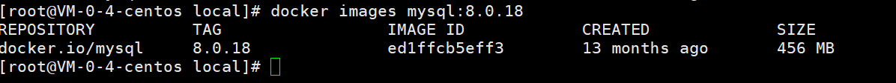

### 安装mysql8.0.18容器

```
docker run -p 3306:3306 --name mysql8.0.18 -e MYSQL_ROOT_PASSWORD=root -d mysql:8.0.18
```

```
备注：
-p 将本地主机的端口映射到docker容器端口（如果本地3306端口被占用 -p 3307:3306）
--name 容器名称命名
-e 配置信息，配置root密码
-d 镜像名称
```

###  查看mysql容器运行情况 

```
docker ps
```

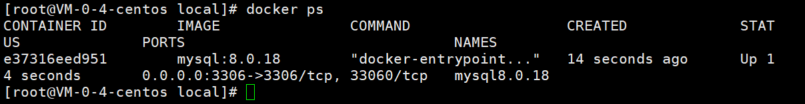

###  docker登录mysql 

```
docker exec -it mysql8.0.18 bash
```

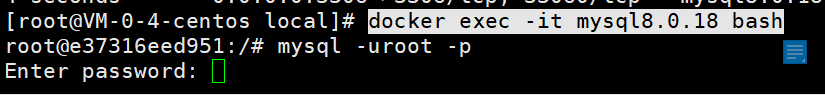

输入密码即可

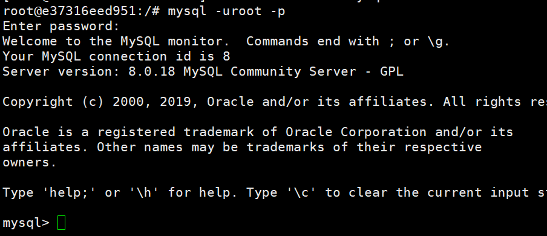

**登录成功**

### 使用客户端远程登陆mysql

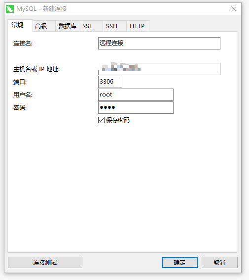

如果连接报以下错误，说明mysql8 加密方式不对

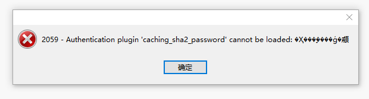

更改加密方式：

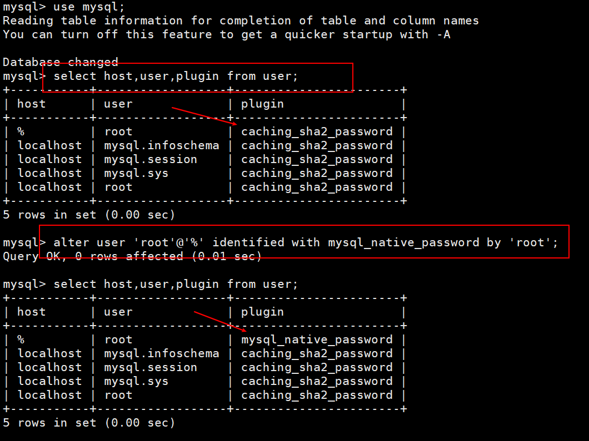

连接成功

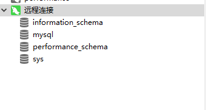


### docker 常用命令

```
docker search 镜像名称 //搜索镜像
docker pull 镜像名称:版本号 //拉取对应版本的镜像
docker pull 镜像名称 //默认拉取最新的镜像
docker images //查看本地已下载的镜像
docker ps    //查看正在运行的容器
docker ps -a //查看所有的容器（包括run、stop、exited状态的）
docker container ls //查看正在运行的容器
docker rm 容器ID //只能删除没有在运行的容器
docker rm -f 容器ID //可以删除正在运行的容器
docker run -p 本地主机端口号:容器服务端口号 --name 容器名字 [-e 配置信息修改] -d 镜像名字
docker start 容器ID //启动容器
docker stop 容器ID //终止容器
docker rmi 镜像名称orID //删除镜像
```

