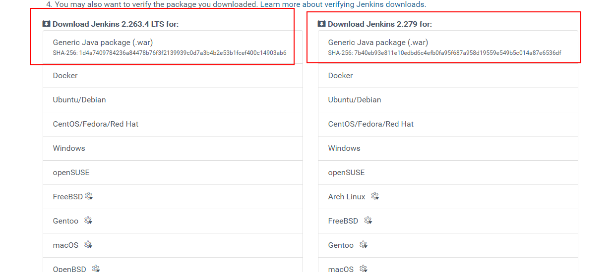

先安装jdk  安装教程

https://blog.csdn.net/pdsu161530247/article/details/81582980

 官网下载 Jenkins.war 包

 https://www.jenkins.io/download/ 



上传下载好的包到/usr/local下，执行命令启动

```
java -jar jenkins.war
```

 进入服务器 自动安装

http://服务器ip/jenkins

运行jenkins (后台运行)

```
nohup java -jar jenkins.war
```

初始化密码所在位置

```
/root/.jenkins/
```

