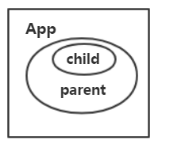
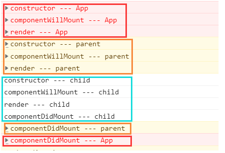
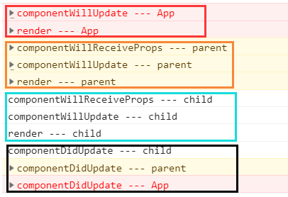
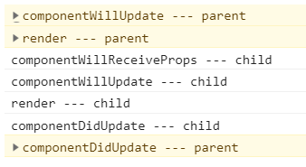
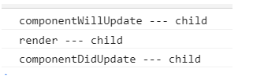
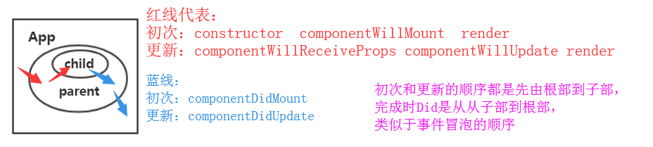
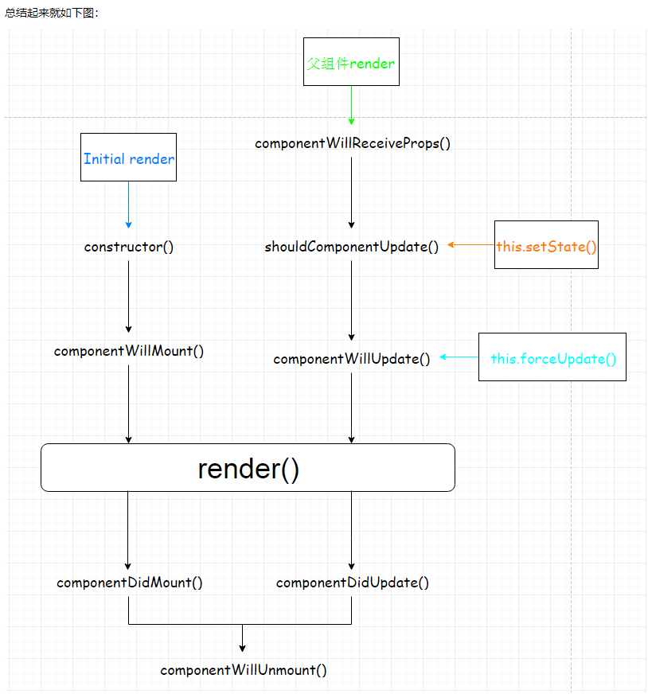
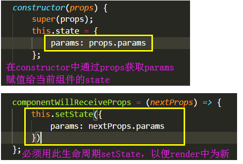

## 1、组件生命周期的执行次数是什么样子的？？？

```
只执行一次： constructor、componentWillMount、componentDidMount

　　执行多次：render 、子组件的componentWillReceiveProps、componentWillUpdate、componentDidUpdate

　　有条件的执行：componentWillUnmount（页面离开，组件销毁时）

　　不执行的：根组件（ReactDOM.render在DOM上的组件）的componentWillReceiveProps（因为压根没有父组件给传递props）
```

## 2、组件的生命周期执行顺序是什么样子的？？？

　　假设组件嵌套关系是 App里有parent组件，parent组件有child组件。

  


 如果不涉及到setState更新，第一次渲染的顺序如下： 



```
App：   constructor --> componentWillMount -->  render --> 
parent: constructor --> componentWillMount -->  render --> 
child:    constructor --> componentWillMount -->  render  --> 
componentDidMount (child) -->  componentDidMount (parent) --> componentDidMount (App)
```

 这时候触发App的setState事件 



```
App：   componentWillUpdate --> render --> 
parent: componentWillReceiveProps --> componentWillUpdate --> render --> 
child:    componentWillReceiveProps --> componentWillUpdate --> render -->
componentDidUpdate (child) -->  componentDidUpdate (parent) --> componentDidUpdate (App)
```

 那如果是触发parent的setState呢？ 



```
parent： componentWillUpdate --> render --> 
child:     componentWillReceiveProps --> componentWillUpdate --> render --> 
componentDidUpdate (child) -->  componentDidUpdate (parent) 
```

 那如果是只是触发了child组件自身的setState呢？ 



```
child： componentWillUpdate --> render -->  componentDidUpdate (child)
```

**结论**：

**1、如图：完成前的顺序是从根部到子部，完成时时从子部到根部。（类似于事件机制）**

**2、每个组件的红线（包括初次和更新）生命周期时一股脑执行完毕以后再执行低一级别的红线生命周期。**



 **3、第一级别的组件setState是不能触发其父组件的生命周期更新函数，只能触发更低一级别的生命周期更新函数**。 



**提问：那么这里提一个问题，如果App里面有多个parent1 parent2 ...，parent里由多个child，那么生命周期执行顺序应该时什么样的？？？？**

结论：一套组件（父包括子，子包括孙）执行的时候一个整体，执行完毕在执行下一套，用到这里就是App里先执行parent1和parent1的子，子的子。。。，然后完毕再执行parent2这一套。

## 3、什么时候该用componentWillReceiveProps？

  是否每个子组件都需要componentWillReceiveProps生命周期函数来更新数据吗？ 你的原则是？？

 

A、开始前首先需要知道componentWillReceiveProps函数有一个参数nextProps，它是一个 **{ 对象 }** ，从单词就可以看出它是**update时候**（也就是下一次）**父组件传递过来的props**。

B、还要知道 "第一条中" 所讲解的有些生命周期函数只执行一次，而有的执行多次，其中**componentWillReceiveProps执行多次，而constructor等执行一次**。

C、还需知道在子组件中每次传递过来的**this.props对象其实和componentWillReceiveProps的nextProps是一样的，都是最新的**。

D、由"第一条"得知： componentWillReceiveProps生命周期是在**更新子组件最先执行的**，优先于compoentWillUpdate，更优先于render。

E、render函数里不能使用setState()，否则会造成死循环。

 

那么知道了以上呢？ 

 

由C得知， this.props 和 componentWillReceiveProps的nextProps都是一样的，通过this.props就可以取到最新的值， 那么componentWillReceiveProps还有必要吗？

所以：**大部分情况下 componentWillReceiveProps 生命周期函数是没用的，即可以略去不写，因为它确实没什么用**。

 

但是情况1：

　　由D得知，componentWillReceiveProps是最先执行的，所以在其内可以setState(｛｝)，在接下来的render中能拿到最新的state后值，再加上B得知，

如果是下面这种情况： **在constructor函数中初始化了某个state，必须用 componentWillReceiveProps 来更新state，以便render中为新的state值。**



情况2：

　　如果父组件有一些请求，每次参数更新的时候才发请求，同时和子组件的关系比较密切，

可以将数据请求放在componentWillReceiveProps进行执行，需要传的参数则从(nextProps)中获取。

而不必将所有的请求都放在父组件中，**于是该请求只会在该组件渲染时才会发出，从而减轻请求负担**。

 情况3：

　　**watch监听props值变化，对子组件进行处理**，比如：当传入的props.value发生变化，执行一些动作。 

　　如果你接触过vue，会知道vue中有一个关于watch的选项，是根据setter获取新旧值，进行动作的执行

　　而react中最合适做watch的时机是在componentWillReceiveProps中

```
componentWillReceiveProps(nextProps) {
        // this.props中的值是旧值
        // nextProps中的值是新值
    const { value: oldValue } = this.props;
    const { value: newValue } = nextProps;
    if (newValue !== oldValue) {
            // TODO...
    }
}
```

**结论： 大部分情况下 componentWillReceiveProps 生命周期函数是没用的，即可以略去不写，**

但是在constructor函数中初始化了某个state，必须用 componentWillReceiveProps 来更新state，不可省去，否则render中的state将得不到更新。
同时如果您想在子组件监听watch值变化做处理，也可以用到componentWillReceiveProps

注意：使用componentWillReceiveProps的时候，不要去向上分发，调用父组件的相关setState方法，否则会成为死循环。

