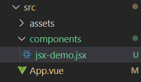
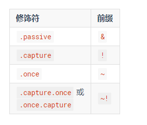
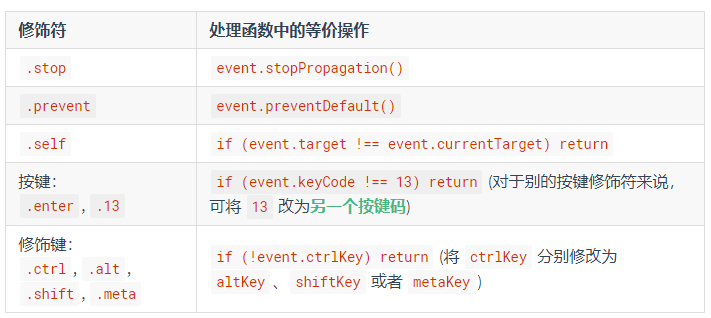
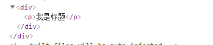
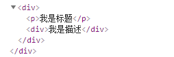
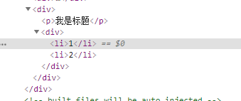
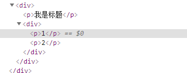
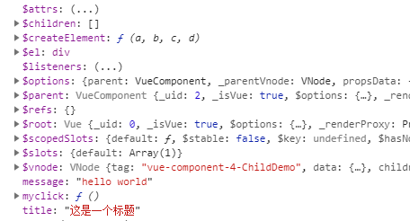
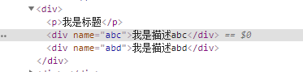

### vue@2.x版本的使用说明

### jsx在vue中的使用说明：

 Vue 推荐在绝大多数情况下使用模板来创建你的 HTML。然而在一些场景中，你真的需要 JavaScript 的完全编程的能力。这时你可以用**渲染函数**，它比模板更接近编译器。 

这句话看起来很官方，总的来说就是使用模板创建html，需要做一次编译转化的过程，而使用渲染函数，少做一些工作！

#### 安装

在vue中，我们直接可以使用jsx语法吗？非也，首先我们需要一个babel做jsx的编译工作

```
npm install @vue/babel-preset-jsx @vue/babel-helper-vue-jsx-merge-props
```

这是在vue的2.x中用到的babel

在babel.config.js中加入如下代码！

```
module.exports = {
  presets: ['@vue/babel-preset-jsx'],
}
```

vue3.x中用到的是

```
npm install @vue/babel-plugin-jsx -D
```

在 .babelrc文件中加入如下代码！

```
{
  "plugins": ["@vue/babel-plugin-jsx"]
}
```

#### 使用

如果你以前有过react代码的编写经验，看下vue的jsx语法，是不是很眼熟

```
export default {
  data() {
    return {
      message: 'hello world'
    }
  },
  methods: {

  },
  mounted() {

  },
  render() {
    let { message } = this;
    return (
      <div>{message}</div>
    )
  }
}
```

这里说明一下，文件的后缀名可以是.vue 也可以是.jsx



#### Attributes/Props如何使用

父组件如何传递数据给子组件，跟模板中的基本一致，只是少了前面的数据绑定的冒号 ‘ ：’

```
<childDemo message={this.message} />
```

原生元素中如何加入属性

```
<div title={this.title}>{this.message}</div>
<input type="text" placeholder="请输入" />
```

或者可以直接编写成

```
const attrs = {
      type: 'text',
      placeholder: '请输入'
    }
    return (
      <div>
        <div title={this.title}>{this.message}</div>
        <input {...{ attrs: attrs }} />
      </div>
    )
```

#### 事件如何编写

```
<button onClick={this.myclick}>这是一个按钮</button>
```

 元素属性跟事件结合起来可以这样编写

```
render() {
    const myAttrs = {
      'class': {
        foo: true,
        bar: false
      },
      style: {
        color: 'red',
        fontSize: '14px'
      },
      // 普通的 HTML attribute
      attrs: {
        id: 'foo'
      },
      on: {
        click: this.myclick
      },
    }
    return (
      <div>
        <button {...myAttrs}>这是一个按钮</button>
        <button onClick={this.myclick}>这是一个按钮</button>
      </div>
    )
  }
```

如果事件中修饰符又该如何编写呢

比如在模板中 官方提供的是这样的语法

```
<!-- 阻止单击事件继续传播 -->
<a v-on:click.stop="doThis"></a>

<!-- 提交事件不再重载页面 -->
<form v-on:submit.prevent="onSubmit"></form>

<!-- 修饰符可以串联 -->
<a v-on:click.stop.prevent="doThat"></a>

<!-- 只有修饰符 -->
<form v-on:submit.prevent></form>

<!-- 添加事件监听器时使用事件捕获模式 -->
<!-- 即内部元素触发的事件先在此处理，然后才交由内部元素进行处理 -->
<div v-on:click.capture="doThis">...</div>

<!-- 只当在 event.target 是当前元素自身时触发处理函数 -->
<!-- 即事件不是从内部元素触发的 -->
<div v-on:click.self="doThat">...</div>
<!-- 点击事件将只会触发一次 -->
<a v-on:click.once="doThis"></a>

<!-- 滚动事件的默认行为 (即滚动行为) 将会立即触发 -->
<!-- 而不会等待 `onScroll` 完成  -->
<!-- 这其中包含 `event.preventDefault()` 的情况 -->
<div v-on:scroll.passive="onScroll">...</div>
```

而在jsx中，该如何用呢？

```
on:{
        '~click': this.myclick
}
```

这是什么意思呢？看官网给的详细说明



 对于所有其它的修饰符，私有前缀都不是必须的，因为你可以在事件处理函数中使用事件方法： 



 这里是一个使用所有修饰符的例子： 

```
on: {
  keyup: function (event) {
    // 如果触发事件的元素不是事件绑定的元素
    // 则返回
    if (event.target !== event.currentTarget) return
    // 如果按下去的不是 enter 键或者
    // 没有同时按下 shift 键
    // 则返回
    if (!event.shiftKey || event.keyCode !== 13) return
    // 阻止 事件冒泡
    event.stopPropagation()
    // 阻止该元素默认的 keyup 事件
    event.preventDefault()
    // ...
  }
}
```

#### 插槽的使用：

首先回忆一下在模板中，插槽的使用方法：

至于插槽是什么，这里就不多说了，我的理解就是在子组件中做占位符用的，可以替代html 组件等

```
<!--子组件 child.vue-->
<template>
  <div>
    <p>我是标题</p>
    <slot></slot>
  </div>
</template>
```

```
<!--父组件-->
<child></child>
```

编译后页面中看到



如果child中的加入内容

```
<child>
      <div>我是描述</div>
 </child>
```

编译后显示为



这是匿名模板中的插槽的用法

具名插槽在slot中加入属性 name就可以，详细请看官方文档

我们看下插槽作用域

```
<!--子组件child-->
<template>
  <div>
    <p>我是标题</p>
    <slot :list="list">
       <div>
          <li v-for="(item,index) in list" :key="index">{{item.id}}</li>
       </div>
    </slot>
  </div>
</template>
<script>
export default {
  data() {
    return {
      list: [
        {
          id: 1
        }, {
          id: 2
        }
      ]
    }
  }
}
</script>
```

```
<!--父组件-->
<child></child>
```

渲染的结果将是默认插槽



如果我不想使用默认插槽的这种结构，又想使用子组件的数据，重新渲染一个，又将如何做呢？

 **插槽 prop 允许我们将插槽转换为可复用的模板，这些模板可以基于输入的 prop 渲染出不同的内容。**这在设计封装数据逻辑同时允许父级组件自定义部分布局的可复用组件时是最有用的 

官方的这两句话，挺有用的，后面封装组件会大量用到！意思就是，子组件中的数据，我们从父组件传递过来，而且提供一个默认的模板，如想改变模板，在父组件中自定义模板！

我们还是看看如何在父组件中替换子组件的模板

子组件代码不变，更改父组件的代码为

```
<child>
      <template v-slot:default="data">
        <div>
          <p v-for="(item,index) in data.list"
             :key="index">{{item.id}}</p>
        </div>
      </template>
    </child>
```

页面渲染后



成功替换了，但是什么意思呢？

v-slot:default="data"中的data就是将你的插槽数据包装在一个对象里，名字任意

default是插槽的名字，这里是默认插槽，如果是具名插槽，就改为具名插槽的名字

按照这个意思，包装在一个对象里，那我们可以使用对象解构，代码如下

```
<child>
      <template v-slot:default="{list}">
        <div>
          <p v-for="(item,index) in list"
             :key="index">{{item.id}}</p>
        </div>
      </template>
    </child>
```

这就是模板中的插槽！

说了这么多，那jsx中插槽是如果使用的呢？我看了很多，文章都没解释清楚，我来总结下：

#### 插槽在jsx中的使用

匿名插槽很简单

```
<!--子组件-->
render() {
    return (
      <div>
        <p>我是标题</p>
        {this.$slots.default}
      </div>
    )
  }
```

```
<!--父组件-->
render() {
    return (
      <childDemo>
        <div>我是描述</div>
      </childDemo>
    )
  }
```

看完代码之后，是不是感觉没啥区别，就是在render中使用了js的语法

没错，我们看下，在子组件中的this到底有什么



看完之后，我们找到了$slots $scopedSlots这就是插槽中的两个属性

具名插槽如何编写

```
<!--子组件-->
render() {
    return (
      <div>
        <p>我是标题</p>
        {this.$slots.default}
        {this.$slots.ab}
        {this.$slots.ad}
      </div>
    )
  }
```

```
<!--父组件-->
<childDemo message={this.message}>
        <div name="abc">我是描述abc</div>
        <div name="abd">我是描述abd</div>
      </childDemo>
```

渲染结果



匿名跟具名插槽都相对来说，简单

作用域插槽如何使用呢？

```
  <!--子组件-->
  render() {
    return (
      <div>
        <p>我是jsx作用域插槽标题</p>
        {this.$scopedSlots.default(this.list)}
      </div>
    )
  }
```

```
<!--父组件-->
render() {
    return (
      <childDemo message={this.message}
        scopedSlots={{
          default: (props) => {
            console.log(props)
            return (
              <div>
                {props.map(item => {
                  return <p>{item}</p>
                })}
              </div>
            )
          }
        }}></childDemo>
    )
  }
```

这就是作用域插槽！