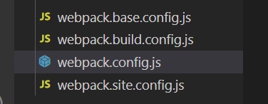
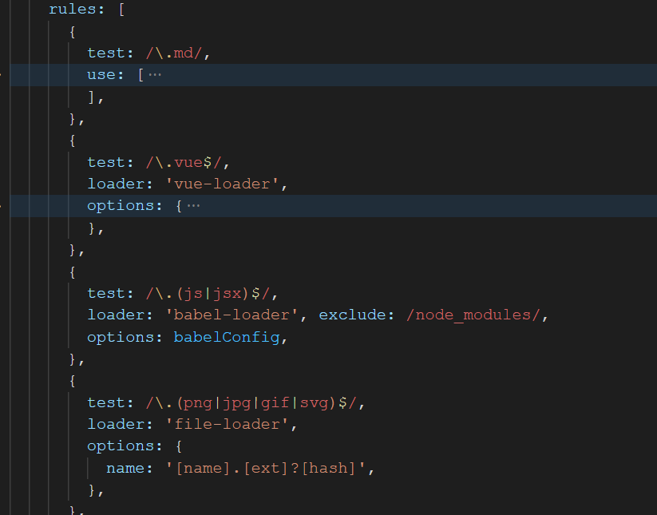
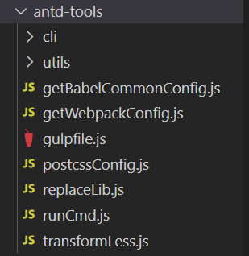
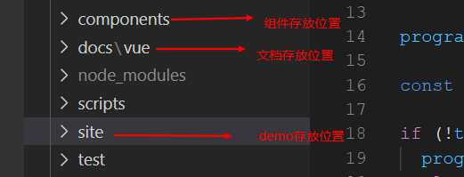

### 1.如何参考antd组件库，打造一套属于自己的组件库

目前antd版本已经更新到2.x，对应的vue版本是3.0.0,目前为止已经相当成熟，参考代码我建议先从最原始的版本开始学起，然后升级到最新版本，相对而言比较容易！（直接上手最新版本，不建议）

### 1.1 更新最原始的代码仓库

 https://github.com/vueComponent/ant-design-vue/tags?after=0.4.2 

一起看下，webpack配置（webpack使用的是3.6.0）版本不一样，配置稍微有些差异，注意一下就可以

相对与最新版本，比较清晰，我们平时做项目时，除了脚手架构建，也差不多像图片的配置

看下使用了哪些loader

看完之后，是不是跟自己做的项目，没啥区别，多了一个vue-antd-md-loader（这个loader是转译md文件的后面会说到）

除此之外，组件库的配置还有antd-tools这个文件夹下

antd的打包配置，除了webpack还使用了gulp，有时间的可以学习下，两者之间的结合！

### 1.2 demo以及组件存放的位置

  site文件夹的内容，后面会详细介绍！

  在阅读antd源码之前，首先要了解vue-jsx语法！后面会介绍

  目录结构先了解到这！